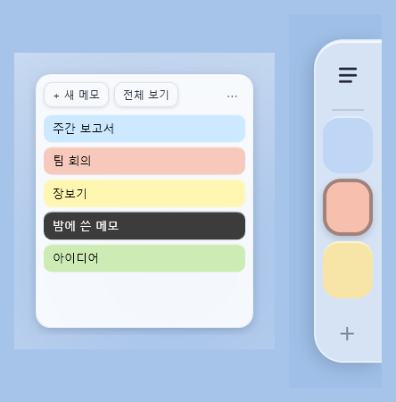
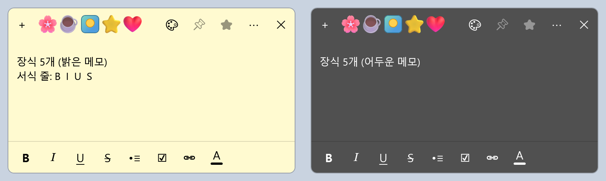
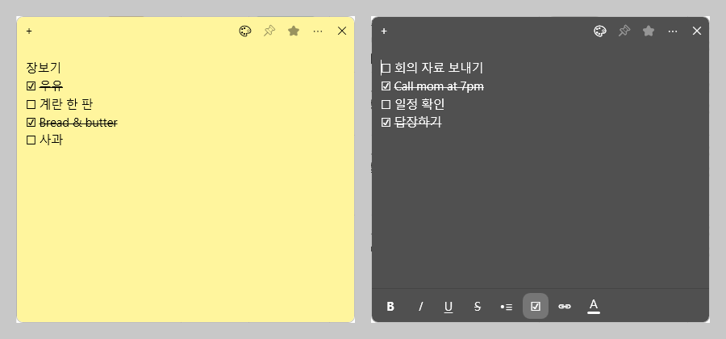
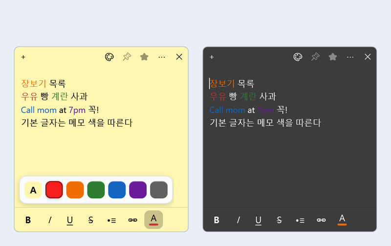
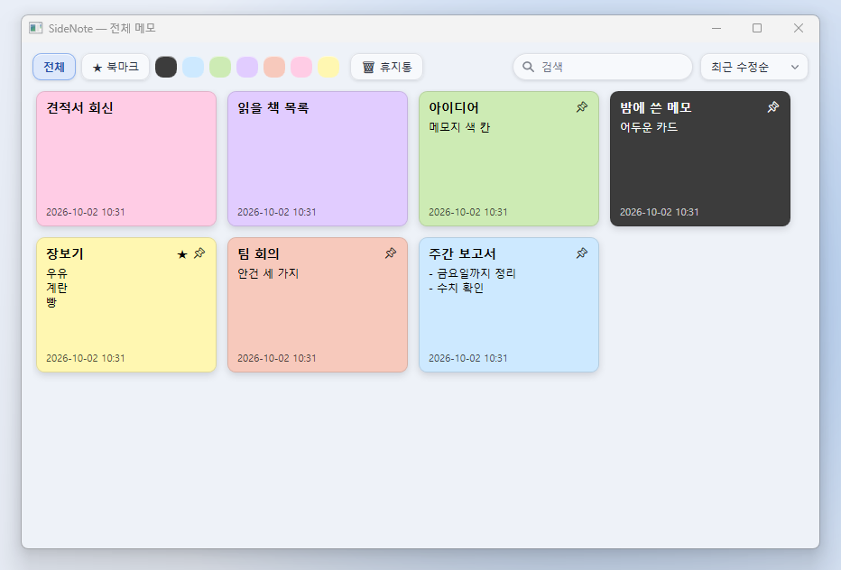
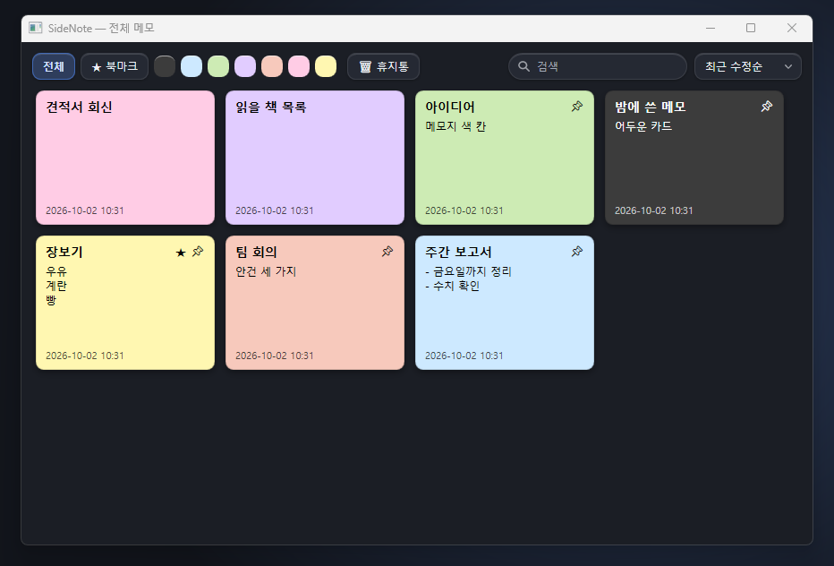

# 📝 SideNote

**화면 가장자리에 붙어 사는 메모 앱**

떠오른 생각은 바로 적고, 자주 보는 메모는 사이드바에 꽂아 두세요.
메모는 내 컴퓨터에만 저장되고, 인터넷으로 보내지 않아요.

[**⬇ 최신 버전 받기**](https://github.com/SuHyun-git/SideNote-releases/releases/latest)

Windows 10 · 11 &nbsp;|&nbsp; 설치 파일 하나로 끝 (.NET·DB 따로 설치 필요 없음) &nbsp;|&nbsp; 무료

---

## 이런 분께 좋아요

- 화면 한쪽에 할 일·메모를 늘 띄워 두고 싶은 분
- 메모가 많아져서 **검색·색상별·북마크**로 찾고 싶은 분
- 회사 PC처럼 **인터넷이 막힌 곳**에서도 쓰고 싶은 분 (메모는 PC 안에만 저장)

## 한눈에 보기

### 사이드바와 빠른 메모
화면 끝에 붙은 **사이드바**에 고정한 메모가 색 칸으로 보여요. 마우스를 올리면 **빠른 메모**가 펼쳐지고, 칸을 누르면 그 메모가 바로 열려요.

### 메모
굵게·기울임·밑줄·취소선·글머리 기호·**체크 목록**·링크·**글자 색과 크기**까지. 위쪽에는 그림이나 이모지로 **메모지 꾸미기**도 할 수 있어요.

<table>
<tr>
<td></td>
<td></td>
</tr>
<tr>
<td align="center">체크하면 취소선이 그어지는 체크 목록</td>
<td align="center">글자 색 · 글자 크기</td>
</tr>
</table>

### 전체 메모
모든 메모를 카드로 모아 보고 **검색 · 색상별 · 북마크 · 정렬**로 찾아요. 카드를 끌어다 휴지통에 놓으면 지워지고, 30일 안에는 되살릴 수 있어요.

<table>
<tr>
<td></td>
<td></td>
</tr>
<tr>
<td align="center">밝은 모드</td>
<td align="center">어두운 모드</td>
</tr>
</table>

## 주요 기능

| | |
|---|---|
| 📌 **사이드바 고정** | 자주 보는 메모 5개를 화면 끝에. 끌어서 위·아래·왼쪽·오른쪽 어디든 붙여요 |
| ✍️ **편한 서식** | 서식 줄 버튼과 단축키(Ctrl+B/I/U/T, Ctrl+Shift+L, Ctrl+Shift+C, Ctrl+K) |
| ☑️ **체크 목록 · 가로줄** | 체크하면 취소선, 빈 줄에 `---` + Enter 로 가로줄 |
| 🎨 **색상** | 메모 색, 글자 색, 기본 글자 크기까지 내 마음대로 |
| 🔎 **전체 메모** | 검색, 색상별·북마크 보기, 정렬, 휴지통 (30일 뒤 자동 정리) |
| 💾 **자동 저장** | 입력을 멈추면 바로 저장. 껐다 켜도 열려 있던 메모가 그 자리에 |
| 🌓 **화면 모드** | 시스템 설정 따르기 / 밝은 / 어두운 |
| 🖼️ **나만의 아이콘 · 꾸미기** | 앱 아이콘을 내 그림으로, 메모 위쪽에 그림·이모지 장식 |
| 🔄 **자동 업데이트** | 켤 때 새 버전을 알려 주고, 버튼 하나로 업데이트 |

## 설치

1. [**Releases**](https://github.com/SuHyun-git/SideNote-releases/releases/latest) 에서 **Assets** 를 펼치고 `SideNote-win-Setup.exe` 를 받아요.
2. 받은 파일을 실행하면 바로 설치되고 SideNote가 켜져요. (관리자 권한 필요 없음)
3. 파란 **"Windows의 PC 보호"** 창이 뜨면 **[추가 정보] → [실행]** 을 눌러요.
   > 아직 코드 서명을 하지 않은 개인 프로그램이라 처음 한 번 뜨는 경고예요.

> Assets의 다른 파일(`.nupkg`, `RELEASES`, `releases.win.json` 등)은 업데이트용이라 받지 않아도 돼요.

### 업데이트
- 켤 때 새 버전이 있으면 알려 줘요. **[지금 업데이트]** 를 누르면 받아서 다시 켜져요.
- 인터넷이 안 되는 PC는 새 `SideNote-win-Setup.exe` 를 받아 다시 실행하면 돼요. **메모와 설정은 그대로** 남아요.
- 지금 버전은 빠른 메모의 **⋯ → 업데이트 확인** 에서 볼 수 있어요.

### 내 메모는 어디에?
`C:\Users\<내 계정>\AppData\Roaming\SideNote\` 폴더에 저장돼요. 앱을 다시 설치하거나 지워도 이 폴더는 남아요. 백업하려면 SideNote를 끄고 이 폴더를 복사하세요.

### 지우기
**설정 → 앱 → 설치된 앱 → SideNote → 제거**

## 자주 묻는 것

사이드바가 안 보여요

작업표시줄의 SideNote 버튼을 누르거나 SideNote를 한 번 더 실행하세요. SideNote는 하나만 켜지고, 이미 켜져 있으면 사이드바를 보여 줘요.

백신이 위험하다고 해요

새로 만든 개인 프로그램이라 생기는 오탐이에요. 받은 곳이 이 페이지가 맞는지 확인해 주세요.

메모를 실수로 지웠어요

전체 메모 → **휴지통** 에서 [복원] 하세요. 30일이 지나면 완전히 지워져요.

6번째 메모를 고정할 수 없어요

사이드바에는 5개까지 고정할 수 있어요. 하나를 빼고 다시 해 주세요.

---

만든 사람: **SuHyun** &nbsp;·&nbsp; 의견이나 버그는 알려 주세요

